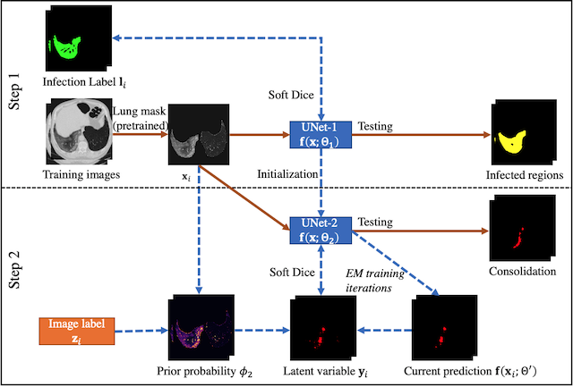
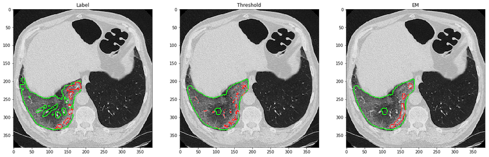

## Severity and Consolidation Quantification of COVID-19 from CT Images Using Deep Learning Based on Hybrid Weak Labels
This is the core code for the supervised segmentation of infection and weakly supervised segmentation of the consolidation. EM algorithm was used for the weak-label training, which used only patient-level annotation to train a segmentation network for consolidation regions. The patient-level information is the exsitence of the consolidation in this patient. The good performance was mainly achieved from the pixel intensity prior model built into the EM algorithm. 

EM algorithm is very easy to implement, no work need to be done for the network (you don't need to write any tf.operations). If you already have a supervised learning framework built, to change it to EM, you only have to:
1. At each iteration, do a prediction first;
2. Alter the output according to the algorithm;
3. Do one iteration of supervised learning using the modified output. 
The majority of the efforts during the implementation of EM will be how to organize your data. 

Our paper will be online soon. The original paper for the EM algorithm can be found [here](https://openaccess.thecvf.com/content_iccv_2015/html/Papandreou_Weakly-_and_Semi-Supervised_ICCV_2015_paper.html). 

Please see the following flowchart for the workflow of the supervise+EM training. UNet1 is the fully supervised network for infected region segmentation. UNet2 is the EM-trained network for consolidation segmentation.



The repository contains the following three parts:
1. `./preprocess` provides a pipeline to ready the images from MedSeg for network training and testing
2. `./segmentation` provides the training, testing and visualization for UNet1&2. 
3. `./weights` host the trained checkpoints for UNet1&2 that has the best performance. 

### Requirements
We used conda during our development. Please note that **preprocess** and **segmentation** had different running environments. Please refer to the **environment.yml** under the corresponding folders. The main reason is that we used a legacy code of UNet developed around 2016, so we used Python2.7 for the segmentation for stablity. 

We used https://github.com/JoHof/lungmask for the lung mask segmentation in the preprocess. So you need to run:
```
git+https://github.com/JoHof/lungmask
```
to install the package under the preprocess environment.

### Preprocess
The input to the network is multislice CT images of 256x256x7, with slice thickness between 3-6mm. We provided the pipeline in `./preprocess/preprocess.sh` which directly gives the needed npz files for the segmentation task. The npz files have the following components:
- **img**: of size `nslices x 256 x 256 x 7`. This is the normalized image after applying the lung mask.
- **label**: of size `nslices x 256 x 256 x 1`, corresponding to the central slice of the input slices
- **lung**: of size `nslices x 256 x 256 x 1`, lung mask
- **annotation**: of size `nslices x 6`. Per-slice infection type annotation. Usually the values are all the same for one patient. The 6 digits are corresponding to different type of infections. Currently only the first two are used (GGO and consolidation) 
- **islice**: of size `nslices`. It marks the original slice position for each sample, useful to match with the original CT image.
- **mrn**: of size `nslices`. It is the identifier for individual CT images, so that each slice is traceble. 

The preprocess takes nii format input files put in one directory, and will generate the final output directory like:
- `./npzs/0.npz`: The npz data file
- `./ct_origin/`: holds the nii files of resampled CT images (512x512, 5mm slice thickness) for visualization

### Segmentation
We provided `test_unet1.py`, `test_unet2.py`, `test.sh` and `visualization.ipynb` to reproduce the results in our paper on the MedSeg dataset. `test.sh` is the script which calls `test_unet1.py` and `test_unet2.py` sequentially. It would generate the result shown below, where the images are labels, consolidation with thresholding (-200 HU), and the EM-trained network. The red borders marked the areas of predicted consolidation, and the green ones are GGO.



We also provided the training code as `train_unet1.py` and `train_unet2_em.py`. However, we cannot provide the training dataset right now due to patient privacy. The code can run with the medseg dataset but it cannot reproduce our trained weights due to small sample size. If you can adapt your dataset and annotations to the same with MedSeg, you can use the preprocess pipeline to generate compatible inputs. For the consolidation annotation, we suggest you can put a value 2 anywhere on the labels so the preprocess can consider this image has consolidation.  

### Inference Model (TODO)
Currently we do not have an end-to-end inference model for the consolidation segmentation (from dicom/nii directly to consolidation map). But we may work on this in the future if we have spare hands in the group. Any suggestion and contributions are also welcomed. 